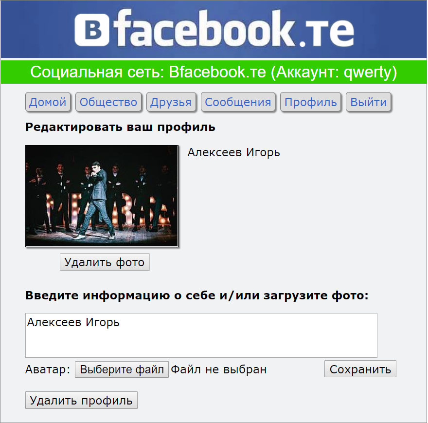
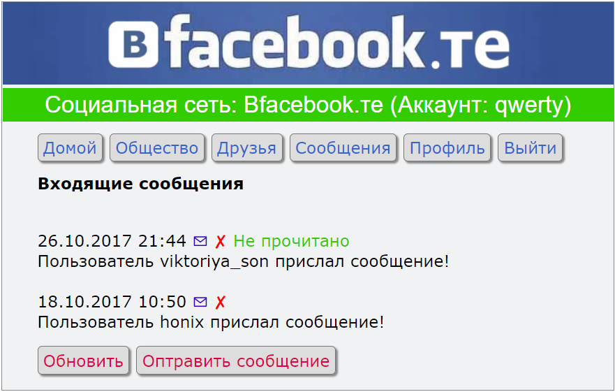
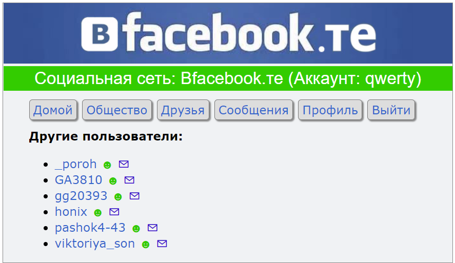

# vFacebook.te
Simple Social Network with using PHP, JS, MySQL, HTML and CSS

Contains simple functions:
- registration and authorization;
- adding friends;
- exchange of messages;
- personalize your profile (avatar and information about you);
- account deletion.

Information is stored in a database on the server and is not encrypted!
There is no mobile version

You can visit it by ref https://aistj.000webhostapp.com/index.php 

    
    
  

